|![ref1]|SMT Troubleshooting Guide|MSM SOP Ref# |UML/EMS/0801 |
| - | - | - | - |
|||Document Number |
UML-SMT-022 

00![ref2]
|
|||Rev # ||
|||Issue Date  |02\.01.2026 |

|**Purpose:**|
| - |
|The purpose of this document is to provide guide line for SMT defects troubleshooting and which helps to restore the quality requirement standards.  |

|**Scope:**|
| - |
|Surface Mount Technology (Solder paste printing, Pick & Place, Reflow & PCB). |

**Table of Contents:** 

|**Sn** |**Description**  |**Page No** |
| - | - | - |
|1 |Bridging  ||
|2 |Insufficient Solder Topside Fillet  ||
|3 |Insufficient Solder Bottom Side Fillet  ||
|4 |De-wetting or Non-wetting  ||
|5 |Solder Voids or Outgassing (Blow Holes and Pin Holes)  ||
|6 |Solder Skips  ||
|7 |Icicles and Flags (Horns)  ||
|8 |Solder Balls and Splatter  ||
|9 |Solder on Mask ||
|10 |Rough or Disturbed Solder  ||
|11 |Grainy or Dull Solder ||
|12 |Components Lifted ||
|13 |Flooding ||
|14 |Excessive Solder ||

|**Review** |**Name** |||||
| - | - | :- | :- | :- | :- |
|Prepared By |Stanish Vijay |||||
|Reviewed By |Sudhakar Babu |||||
|Approved By |Aditi Sharma |||||
|![ref1]|SMT Troubleshooting Guide|MSM SOP Ref# |UML/EMS/0801 |||
|||Document Number |
UML-SMT-022 

00![ref2]
|||
|||Rev # ||||
|||Issue Date  |02\.01.2026 |||

**1. Quality Factors in Electronics Assembly:** 
The image shows a diagram detailing the factors that influence the Solder joint quality of electronics. The information is organized into five main categories:
*Process*
Process parameter
Paste print
Reflow soldering
Wave soldering
Selective soldering
Hand soldering
Materials
*PCB*
Layout
Solder resist
Storage environment
Surface finish
Specification PCB material
*Machines*
Machine capability
Stability
Reproducibility
Process capability
Energy efficiency
Maintenance
*Operator*
Experience
Workload
Industry knowledge
Processes know-ledg [sic]
Motivation
Attention to detail
*Environment*
Nitrogen supply method
Vibrations
ESD protection

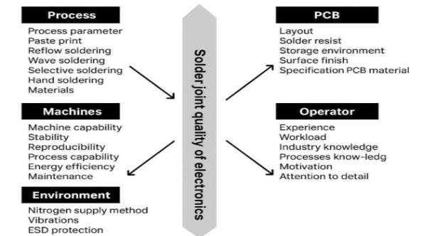

**1.a) Measurement of the Profile with a reference board: ![ref3]**

1. Reflow Profile Measurement with a Reference Board  
2. Using a Reference PCB to Validate the Reflow Process  
3. Determining the Reflow Temperature Curve via Reference Board Data 

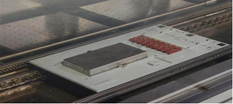

2. **Bridging:** 

Defect Definition: Solder connecting, in most cases, miscon- necting two or more adjacent pads that come into contact to form a conductive path. 

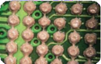 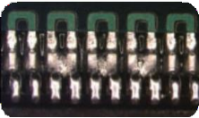 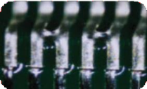

|**Review** |**Name** |||||
| - | - | :- | :- | :- | :- |
|Prepared By |Stanish Vijay |||||
|Reviewed By |Sudhakar Babu |||||
|Approved By |Aditi Sharma |||||
|![ref1]|SMT Troubleshooting Guide|MSM SOP Ref# |UML/EMS/0801 |||
|||Document Number |
UML-SMT-022 

00![ref2]
|||
|||Rev # ||||
|||Issue Date  |02\.01.2026 |||

**2.a) Bridging Possible Causes: PCB** 

|Description |Recommendations |Image |
| - | - | - |
|Pads will contribute to coplanarity issue resulting in poor gasketing during printer setup. |Highly recommended to remove solder mask between adjacent pads especially for fine-pitch components (non-solder mask defined pads). |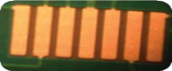|

**2.b) Possible Causes Bridging (Stencil): ![ref3]**

|Description |Recommendations |Image |
| - | - | - |
|Dirty stencil with paste underneath will contaminate the bare board on the next print, attributing a potential bridge. |
•Verify zero print gap set up. •Ensure minimum print pressure. •Increase wipe frequency. 

•Use different stencil cleaning 

chemistry. 
|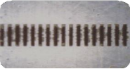|

**2.c) Possible Causes Bridging (Stencil): Stencil tension:** 

Ensure stencil tension is tight. Poor stencil tension will make it impossible to have a good setup for consistent print definition. 

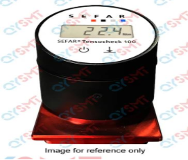

**2.d) Bridging (Stencil Aperture Design):** 

For fine pitch component, it is highly recommended to have the opening slightly smaller than landing pad size to improve stencil to PCB gasketing. 

**2.e) Bridging (Defect Possible Causes in Solder Paste Printer):** 

|**Description** |**Recommendations** |**Image** |
| - | - | - |

|**Review** |**Name** |||||
| - | - | :- | :- | :- | :- |
|Prepared By |Stanish Vijay |||||
|Reviewed By |Sudhakar Babu |||||
|Approved By |Aditi Sharma |||||
|![ref1]|SMT Troubleshooting Guide|MSM SOP Ref# |UML/EMS/0801 |||
|||Document Number |
UML-SMT-022 

00![ref2]
|||
|||Rev # ||||
|||Issue Date  |02\.01.2026 |||

|Poor gasketing – paste oozes out beneath stencil during printing, increasing chance of wet solder paste bridges. |
1. Zero print gap between stencil and PCB 

2. Check paste smear underneath stencil. 

3. Check sufficient stencil tension. 
||
| :- | :- | - |
|Misaligned print will challenge the paste to pull back to pads during molten stage, increasing the potential for bridging. |Ensure print accuracy and consistency for both print strokes. |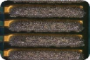|
|Smearing and bridging phenomenon on the next printed board after stencil cleaning operation |
Verify stencil is dry after cleaning and before next print. 

Standard cleaning mode is wet/vacuum/dry. 
||
|Poor print definition with dog ears especially on fine- pitch components |
Check board support. 

Adjust separation speed to achieve minimum dog ears. NB: Different paste chemistry requires different separation speed to minimize dog ears. 
|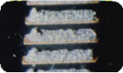|
|Dented squeegee blades could result in uneven print pressure. |Check squeegee blades condition. ||
**2.f) Possible Causes While Component Placement (Pick & Placement):** 

|Description |Recommendations |Image |
| - | - | - |
|Placement inaccuracy will narrow the gap between pads, increasing the chance of bridging. |
Recommendations 

Verify component placement pressure. Use X-ray to verify BGA placement. Use microscope for QFPs. 
||
|Excessive component placement pressure will squeeze paste out of pads. |Verify actual component height against data entered in the machine Component placement height should be ±1/3 of paste height. |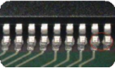|

**2.g) Possible Causes in Reflow Profile:** 

|Description |Recommendations |Image |
| - | - | - |
|Extended soak will input more heat to the paste and result in paste hot slump phenomenon. |
•  Adopt a straight ramp to spike 

profile, without soak zone if possible. 

• 

Be sure to check for BGA voiding when converting from a soak to a straight ramp profile. 
|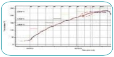|

|**Review** |**Name** |||||
| - | - | :- | :- | :- | :- |
|Prepared By |Stanish Vijay |||||
|Reviewed By |Sudhakar Babu |||||
|Approved By |Aditi Sharma |||||
|![ref1]|SMT Troubleshooting Guide|MSM SOP Ref# |UML/EMS/0801 |||
|||Document Number |
UML-SMT-022 

00![ref2]
|||
|||Rev # ||||
|||Issue Date  |02\.01.2026 |||

**2.f) Possible Causes: Solder Paste:** 

|Description |Recommendations |Image |
| - | - | - |
|Dry paste phenomenon – irregular print shape and inconsistent print volume |
Paste has expired or been exposed to excessive heat. 

Operating temperature within supplier’s recommendations. Check temperature inside printer. Normal requirement around 25°C, 50%RH 
|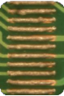|
|Paste oozes out of pads, may form connection with adjacent pads. |
Do not mix using new and old paste. Operating temperature within supplier’s recommendations 

Verify with another batch of paste to confirm problem is batch-related. Perform cold and hot slump test result using IPC-TM-650 Method 2.4.35. 
||
3. **Non-Wet Opens: **

**3.a) Non-Wet Defect Definition:**  

`            `A Non-Wet Open (NWO) defect, also known as non-wet or lifted ball, occurs during the Surface Mount Technology (SMT) assembly reflow process when the solder sphere and solder paste on the BGA have no physical contact with the pad after reflow, yet there was paste on the pad prior to the board entering the oven. Conventional inspection techniques may not detect these defects, which can be identified by the presence of the non-wetted pad after reflow. 

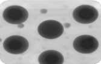

**Non-Wet Opens Defect 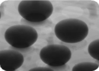**

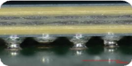

**Possible Causes from PCB:** 

|Description |Recommendations |
| - | - |
|Poor PCB Finish |Adopt better quality metal surface finish such as higher Temperature Resistant OSP or ENIG. |

|**Review** |**Name** |||||
| - | - | :- | :- | :- | :- |
|Prepared By |Stanish Vijay |||||
|Reviewed By |Sudhakar Babu |||||
|Approved By |Aditi Sharma |||||
|![ref1]|SMT Troubleshooting Guide|MSM SOP Ref# |UML/EMS/0801 |||
|||Document Number |
UML-SMT-022 

00![ref2]
|||
|||Rev # ||||
|||Issue Date  |02\.01.2026 |||

|
Components that have a very high warping signature characteristic 

can lead to NWO defects. During reflow, the solder paste can have a higher propensity to adhere 

to the solder sphere vs. the pad, especially on OSP coated boards. 

This happens when the component warps and the distance from the component pad becomes so great that the solder 

paste is physically lifted off the pad and then reflows onto the ball during the time above liquidus (TAL), thus not leaving any solder paste on the pad. 
|
Using a low-temperature solder paste in applications where temperature sensitive components 

are involved can help to avoid Non-Wet Opens (NWO) and other defects. Low temperature soldering is also ideal where higher reflow temperatures may cause failures. 
|
| :- | :- |

Image before and after  cleaning flux off the  assembly  

**Possible Causes from Reflow Profile:**  

|Description |Recommendations |
| - | - |
|Profile |Profile Optimization |

**3.b) Possible Causes from Stencil: ![ref4]**

|Description |Recommendations |
| - | - |
|Insufficient volume of solder at the point of the non-wet open where there is not enough flux left to overcome the OSP once the part comes back from warping. |
Optimize the stencil design by increasing the volume of paste by opening up the stencil apertures to provide more paste volume on 

the pad. Increase the aperture-to-pad ratio to 1:1 or 1:1.1 or based on component warpage. 
|

**Possible Causes from Solder Paste:** 

||Description |||Recommendations ||
| :- | - | :- | :- | - | :- |

|**Review** |**Name** |||||
| - | - | :- | :- | :- | :- |
|Prepared By |Stanish Vijay |||||
|Reviewed By |Sudhakar Babu |||||
|Approved By |Aditi Sharma |||||
|![ref1]|SMT Troubleshooting Guide|MSM SOP Ref# |UML/EMS/0801 |||
|||Document Number |
UML-SMT-022 

00![ref2]
|||
|||Rev # ||||
|||Issue Date  |02\.01.2026 |||

|
Many popular commercially available solder pastes 

have a greater propensity to adhere to the sphere vs. the OSP pad during 

reflow. Along with the high warping signature of these components, this creates a condition in which the paste is no longer in contact with the pad and thus reflows to the ball. 
|
Switch to a solder paste with chemistry specifically designed to be NWO- resistant. A solder paste that has the proper wetting force and time balance characteristics to overcome the paste lifting, but still has enough activity to overcome the OSP on the pad when the part comes out of the warping stage and flattens out is ideal. 

There are a number of solder paste formulations available that have been designed and/or have been tested against this defect. 
|
| :- | :- |

**3.c) Non-Wet Open: 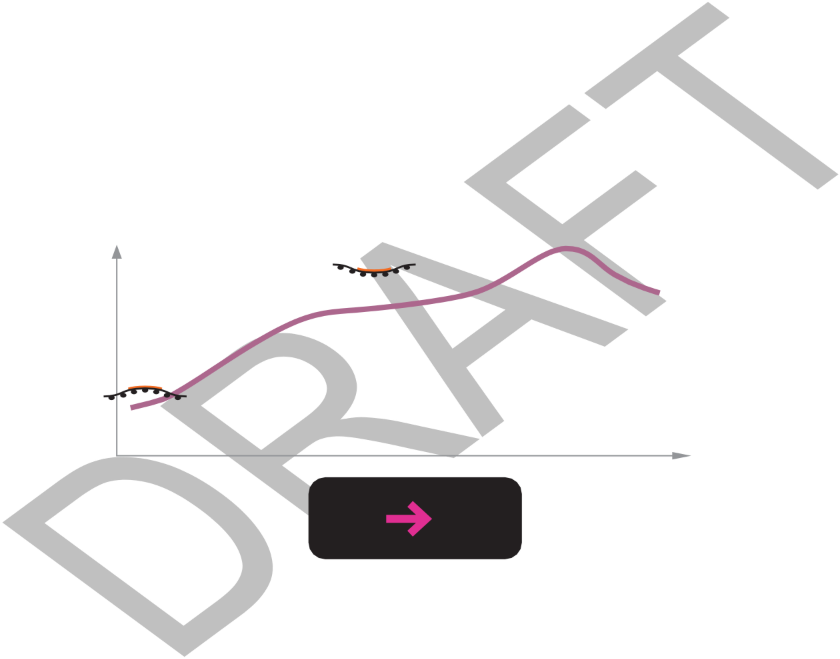**

Non-Wet  Open  Defect  Formation  Mechanism  During  soak,  package-MB  move  away  from  each  other  due  to warpage shape change. Paste starts to lift up from PCB land at ~150-180°C. 

Solder paste preferentially wets to the solder ball rather than the PCB land. Mechanism primarily driven by paste characteristics. 

During reflow, paste is 

fully  melted and wicked 

upward.  Ball and paste 

Package  coalesce. 

continues to 

warp 

upward 

and the  Dfuullryin gm reeflltoewd,  apnads twe iicsk ed paste west 

upward.  Ball and paste to the ball. 

coalesce. 

Solder paste preferentially  wets to  Illustration and image from Intel paper the solder ball  rather than the  presented at SMTAI: “Fundamentals PCB land.  Mechanism primarily  of the Non-Wet Open BGA Solder Joint driven by paste  characteristics.  Defect Formation, 

4. **Insufficient Solder paste Fill:** 

Definition: Amount of solder paste deposited on PWB at printer station is much less than stencil opening design. 

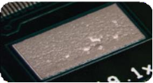

4. **a) Possible Causes from Stencil:** 

|**Review** |**Name** |||||
| - | - | :- | :- | :- | :- |
|Prepared By |Stanish Vijay |||||
|Reviewed By |Sudhakar Babu |||||
|Approved By |Aditi Sharma |||||
|![ref1]|SMT Troubleshooting Guide|MSM SOP Ref# |UML/EMS/0801 |||
|||Document Number |
UML-SMT-022 

00![ref2]
|||
|||Rev # ||||
|||Issue Date  |02\.01.2026 |||

|Description |Recommendations |Image |
| - | - | - |
|Paste scooping effect especially on large pads |
Segment the large opening into smaller apertures. 

Check for excessive squeegee pressure 
|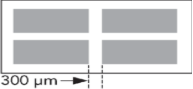|

**4.b) Possible Causes from Solder Paste Printing:** 

|Description |Recommendations |Image |
| - | - | - |
|Paste does not roll into aperture |
Reduce print speed. 

Adopt lower squeegee contact print. Ensure paste is not expired or dry. Ensure sufficient board support. Reduce squeegee pressure. 
|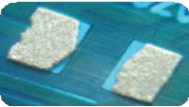|

5. **Insufficient Solder:  Definition:**   

   `                   `Amount of solder paste deposited on PWB at printer station is much less than stencil opening design or, after reflow, insufficient solder to form a fillet at the component leads.** 

**5.a) Possible Causes from Stencil:** 

|Description |Recommendations |
| - | - |
|Solder paste adheres on the stencil aperture walls. |
Area ratio > 0.59 for type 4 powder Aspect ratio > 1.5 

No burr on stencil aperture edge. 
|

**5.b) Possible Causes on Solder paste Printing: ![ref4]**

|Description |Recommendations |
| - | - |
|Print definitions |
Verify print setup 

Reduce print speed to provide sufficient time for paste to roll into aperture. 

Check stencil snap off speed vs. TB recommendation. 
|

**5.c) Possible Causes form Reflow:** 

||Description |||Recommendations ||
| :- | - | :- | :- | - | :- |

|**Review** |**Name** |||||
| - | - | :- | :- | :- | :- |
|Prepared By |Stanish Vijay |||||
|Reviewed By |Sudhakar Babu |||||
|Approved By |Aditi Sharma |||||
|![ref1]|SMT Troubleshooting Guide|MSM SOP Ref# |UML/EMS/0801 |||
|||Document Number |
UML-SMT-022 

00![ref2]
|||
|||Rev # ||||
|||Issue Date  |02\.01.2026 |||

|
Mismatch in CTE between component and PCB. 

can cause solder wicking effect which may look like insufficient solder on pads. 
|
Attach thermocouple on component and PCB. Apply soak profile to minimize delta T before reflow zone. 

Set bottom zones to be higher temperature, if possible, to keep PCB hotter than component leads. 
|
| :- | :- |

**5.d) Possible Causes: Solder:** 

|Description |Recommendations |
| - | - |
|Solder paste viscosity |Check paste conditions such as dry paste phenomenon by verifying if paste rolls or skids along print direction. |

6. **Random Solder Balls:  ![ref5]**

**Definition:**   

`                `After reflow, small spherical particles with various diameters are formed away from the main solder pool. 

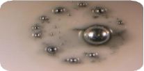

**6.a) Possible Causes form Stencil:** 

|Description |Recommendations |Image |
| - | - | - |
|Paste stuck under the stencil will be transferred onto the solder mask of the next PCB. |
Verify zero print gap set up. Check minimum print pressure used. 

Check cleaning efficiency such as wet/dry/vacuum. 

Check wipe frequency 
|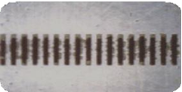|

**6.b) Possible Causes (Reflow): **

|Description |Recommendations |Image |
| - | - | - |
|Fast ramp-up rate or preheat rate will not allow sufficient time for the solvent to vaporize off gradually. |
Slow preheat rate is recommended, typically 

< 1.5°C/sec from room temperature to 150°C. 
|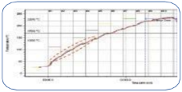|

**6.c) Possible Causes: PCB Moisture** 

|Description |Recommendations |
| - | - |
|
Trapped moisture 

may result in explosive vaporization. 
|Especially for lower grade PCBs such as FR2, CEM1, tends to absorb moisture. Bake 120°C for 4 hours if necessary. |

**6.d) Possible Causes: Solder Paste** 

|Description |Recommendations |Image |
| - | - | - |

|**Review** |**Name** |||||
| - | - | :- | :- | :- | :- |
|Prepared By |Stanish Vijay |||||
|Reviewed By |Sudhakar Babu |||||
|Approved By |Aditi Sharma |||||
|![ref1]|SMT Troubleshooting Guide|MSM SOP Ref# |UML/EMS/0801 |||
|||Document Number |
UML-SMT-022 

00![ref2]
|||
|||Rev # ||||
|||Issue Date  |02\.01.2026 |||

|
Especially for water- soluble solder paste which is hygroscopic, it tends 

to have limited stencil life because of moisture absorption 
|
Minimize exposure time 

Printer temperature and humidity to be within recommendation 

Try new lot of solder paste to verify paste integrity. 

Use coarser powder size, if possible, as fine powder size has more oxides and tends to slump more readily. 
|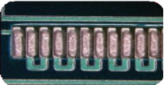|
| :- | - | - |

7. **Paste Drying/Sticking to Squeegee:** 

Definition: When the printer’s squeegee is lifted off the stencil between print strokes, paste should remain primarily ![ref5]on the stencil making it available for the next printing stroke. 

**7.a) Possible Causes:** 

|Description |Recommendations |
| - | - |
|Paste bead too high |
Maintain the solder bead height between 

1\.5 and 2 cm 
|
|Bead diameter too large |Use a taller squeegee blade |
|Paste replenishment not frequent enough |Over time with high component density assemblies, the ratio of metal to flux will increase |
|Printing water soluble paste in extremely low humidity |Better climate control when using water soluble paste |

`                  `T-0 (After 10 Kneads)  T-8 Hours 

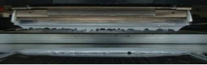 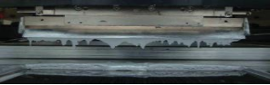

Temperature:  28.3°C  Temperature:  32.2°  C  Humidity: Humidity: 48% RH  30% RH 

` `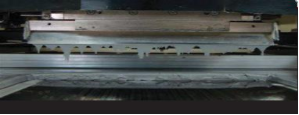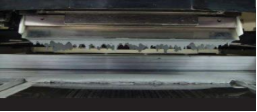

Temperature:  25.8°  C  Temperature:  24.4°  C  Humidity: Humidity: 50% RH  38% RH 

|**Review** |**Name** |||||
| - | - | :- | :- | :- | :- |
|Prepared By |Stanish Vijay |||||
|Reviewed By |Sudhakar Babu |||||
|Approved By |Aditi Sharma |||||
|![ref1]|SMT Troubleshooting Guide|MSM SOP Ref# |UML/EMS/0801 |||
|||Document Number |
UML-SMT-022 

00![ref2]
|||
|||Rev # ||||
|||Issue Date  |02\.01.2026 |||

8. **Solder Spattering:** 

Definition: Solder Spatter phenomenon is very similar to solder balling, but the concern is usually about solder deposited onto Au fingers. 

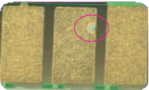

**8.a) Possible Causes: PCB  **

|Description |Recommendations |Image |
| - | - | - |
|Handling of boards |
Do not mix clean and washed boards. Open fresh PCBs from package when ready to run. 

Ensure working area is cleaned thoroughly and not  
||
|Bare boards contamination |Inspect bare PCBs to capture and filter solder found on bare PCB before printing station. ||
**8.b) Possible Causes: Screen**  

|Description |Recommendations |
| - | - |
|Ineffective cleaning of stencil wipe will transfer small particles of solder onto the top surface of the next bare board. |Ensure wipe frequency is set correctly. Use effective solvent, preferably SC10. Use printer machine camera to inspect the effectiveness of stencil cleaning. |

**8:c) Possible Causes: Reflow**  

|Description |Recommendations |Image |
| - | - | - |
|Control the flux out- gassing rate to minimize explosive solder scatter on Au pads. |For SAC 305, set slow ramp rate of 0.3-0.4°C/sec from 217-221°C. |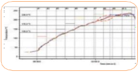|

9. **Mid-Chip Solder Balls (MCSB)** 

**Definition:** After reflow, large solder ball(s) is/are located on the side of the chip components, between the terminations and away from the pads. 

|**Review** |**Name** |||||
| - | - | :- | :- | :- | :- |
|Prepared By |Stanish Vijay |||||
|Reviewed By |Sudhakar Babu |||||
|Approved By |Aditi Sharma |||||
|![ref1]|SMT Troubleshooting Guide|MSM SOP Ref# |UML/EMS/0801 |||
|||Document Number |
UML-SMT-022 

00![ref2]
|||
|||Rev # ||||
|||Issue Date  |02\.01.2026 |||

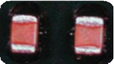

**9.a) Possible Causes: PCB** 

|Description |Recommendations |
| - | - |
|Solder dissociation and does not adhere on solder mask |
Remove solder mask between pads. 

Gap between pad and solder mask is recommended to maintain at least 75µm~100µm, preferably >120µm. 

Solder mask may not be centralized around pad. 
|

`  `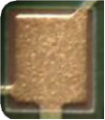 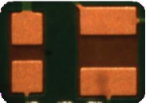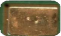

**9.b) Possible Causes: Stencil 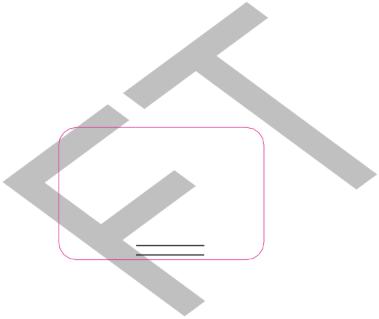**

|Description |Recommendations |Image |
| - | - | - |
|Excess paste squeezes underneath component body tends to dissociate with the main body of solder during reflow. |Home plate or U-shape design may help to reduce the amount of paste potentially squeezed under the component body, onto the mask. |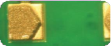|
||NB: Aperture reduction may not be suitable for component size smaller than 0603. Besides, LF alloy has higher surface tension and does not pull back after reflow. |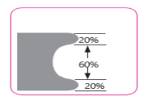|

**9.c) Mid-Chip Solder Balls (MCSB):** 

Definition: After reflow, large solder ball(s) is/are located on the side of the chip components, between the terminations and away from the pads. 

**9.d) Possible Causes: Solder Paste Printing:**  

|Description |Recommendations |
| - | - |
|Paste smearing on solder mask |
Printer set up for zero print gap, verified by paste height consistency without dog ears 

Print alignment accuracy 
|

|**Review** |**Name** |||||
| - | - | :- | :- | :- | :- |
|Prepared By |Stanish Vijay |||||
|Reviewed By |Sudhakar Babu |||||
|Approved By |Aditi Sharma |||||
|![ref1]|SMT Troubleshooting Guide|MSM SOP Ref# |UML/EMS/0801 |||
|||Document Number |
UML-SMT-022 

00![ref2]
|||
|||Rev # ||||
|||Issue Date  |02\.01.2026 |||

**9.e) Possible Causes: Component Placement** 

|Description |Recommendations |
| - | - |
|Excessive  placement  pressure  will  squeeze paste on pad |Verify actual component height against data entered in the machine. Component placement height should be ±1/3 of paste height. |

**9.f) Possible Causes: Reflow** 

|Description |Recommendations |
| - | - |
|Extended soak will input more heat to the paste and result in paste slump phenomenon. |
Adopt a straight ramp to spike profile, without soak zone if possible. 

Be sure to check for BGA voiding when converting from a soak to a straight ramp profile 
|

**10.Tombstoning  **

Definition: A tombstone, sometimes called Manhattan effect, is a chip component that has partially or completely lifted off one end of the surface of the pad. 

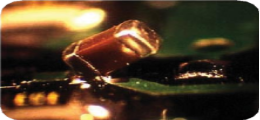

**10.a) Possible Causes: Pad** 

|Description |Recommendations |Image |
| - | - | - |
|Component body must cover at least 50% of both pads |If component terminations are not covering >50% of pads, high tendency to have imbalance wetting force, resulting in tombstoning. Feedback to supplier for alteration if possible. |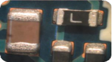|
|Unequal pad size especially with ground pad on one side |
Unequal size means different solder volume, increasing potential for unequal wetting force. If due to design limitation, use a gradual soak ramp rate just before reaching liquidus point, e.g., SAC305, soak @ 

190-220°C for 30-45 
|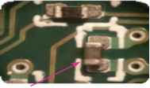|

**10.b)  Possible Causes: Placement Accuracy & Pressure** 

||Description |||Recommendations |||Image ||
| :- | - | :- | :- | - | :- | :- | - | :- |

|**Review** |**Name** |||||
| - | - | :- | :- | :- | :- |
|Prepared By |Stanish Vijay |||||
|Reviewed By |Sudhakar Babu |||||
|Approved By |Aditi Sharma |||||
|![ref1]|SMT Troubleshooting Guide|MSM SOP Ref# |UML/EMS/0801 |||
|||Document Number |
UML-SMT-022 

00![ref2]
|||
|||Rev # ||||
|||Issue Date  |02\.01.2026 |||

|Skew placement will create imbalance wetting force on both pads. |Check other components placement accuracy. Re-teach fiducials if all component shifted, else edit that specific location manually. |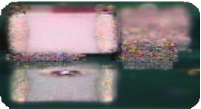|
| :- | :- | - |

**10.c) Possible Causes: Reflow** 

|Description |Recommendations |Image |
| - | - | - |
|Extend soak zone can aid in balancing the wetting force on both pads before paste reaching to molten state |Focus at 30°C before alloy liquidus temperature, e.g., for SAC305, liquidus @ 220°C, ensure soak at 190~220°C for minimum of 30 seconds |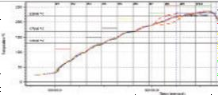|

11. **Voiding: **

Definition: Voids in solder joints are empty spaces within the joint, increasing concern about voiding, especially on BGAs and large pads such as LGAs. 

Two main contributors of voiding are i)outgassing of flux entrapped II)excessive oxidation. 

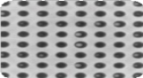 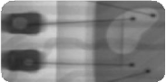 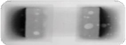

BGA  LGA  Passive 

Component 

**11.a) Possible Causes: PCB** 

|Description |Recommendations |
| - | - |
|Micro-via holes on pads trapped flux and air pockets |
Typically, via holes <6mils will be more difficult to vaporize the flux or air trapped. 

Plug the blinded via holes before printing. Double print helps to pack more solder paste into via holes. 

Use finer powder size. 

Avoid printing paste on top of via holes, instead aperture opening designed around it. 
|

**11.b) Possible Causes: Stencil** 

||Description |||Recommendations ||
| :- | - | :- | :- | - | :- |

|**Review** |**Name** |||||
| - | - | :- | :- | :- | :- |
|Prepared By |Stanish Vijay |||||
|Reviewed By |Sudhakar Babu |||||
|Approved By |Aditi Sharma |||||
|![ref1]|SMT Troubleshooting Guide|MSM SOP Ref# |UML/EMS/0801 |||
|||Document Number |
UML-SMT-022 

00![ref2]
|||
|||Rev # ||||
|||Issue Date  |02\.01.2026 |||

|
For large pads such as LGA, massive solder volume has a lot of flux 

to vaporize during reflow. Any trapped flux will result in voids. 
|
Reduced amount of solder deposit 

Total solder volume reduction can be as high as 45%. 

With solder mask in between, break the large aperture into small openings. 

Without solder mask, cut a large round opening in the middle. 
|
| :- | - |

 55% 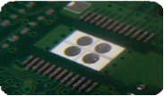

opening 

**11.c) Possible Causes: Reflow Profile:** 

|Description |Recommendations |
| - | - |
|Flux entrapped without sufficient time to outgas |
Establish soak zone from 170~220°C for 60-90 

sec. 

Also make sure profile set between 130~220°C for 180 sec. 
|
|Oxidation rate predominates |
Adopt short profile concept to preserve flux activity, no soak zone. Use nitrogen if possible. 

Reduce the peak temperature to 241°C or below. 
|

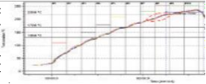

12. **BGA (Ball Grid Array) Head-on-Pillow:** 

**Definition:** Head-on-pillow is an assembly defect in which the spheres from a BGA or CSP don’t coalesce with the solder paste on the PCB pad. It is important to differentiate head-on-pillow from a defect caused simply by insufficient reflow temperature, which is characterized by distinct solder spheres from the paste that have not been properly melted on the pad and BGA solder sphere. With head-on-pillow the soldering 

temperature is sufficient to fully melt the solder sphere and paste deposit, but an impediment to the formation of a proper solder joint exists. 

` `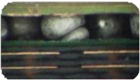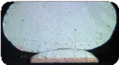

**12.a) Possible Causes: Screen Printer** 

||Description |||Recommendations |||Image ||
| :- | - | :- | :- | - | :- | :- | - | :- |

|**Review** |**Name** |||||
| - | - | :- | :- | :- | :- |
|Prepared By |Stanish Vijay |||||
|Reviewed By |Sudhakar Babu |||||
|Approved By |Aditi Sharma |||||
|![ref1]|SMT Troubleshooting Guide|MSM SOP Ref# |UML/EMS/0801 |||
|||Document Number |
UML-SMT-022 

00![ref2]
|||
|||Rev # ||||
|||Issue Date  |02\.01.2026 |||

|Irregular print definition across the pads may hinder some solder bump locations to be in contact with solder paste. |Verify print definition and measure print height consistency |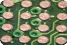|
| :- | :- | - |

**12.b) Possible Causes: PCB/Component** 

|Description |Recommendations |
| - | - |
|Increase paste deposition volume to better compensate for substrate warpage. |Increase print volume by using square aperture vs. round opening, or enlarge overall deposition volume without jeopardizing bridging. |

BGA coplanarity issue  Increase solder volume. 

- Use higher activity paste. 
- Oxidized BGA solder balls  ·  Use nitrogen reflow. 

**12.c) BGA Head-on-Pillow: Possible Causes: Reflow** 

|Description |Recommendations |
| - | - |
|Board warpage especially for double reflow boards or thin PCBs (<1mm thick) |
Recommendations 

Critical to minimize time above Tg, (typically 130°C for FR4 boards) with BGAs mounted. Target to maintain 

< 2 min if possible. 

For second reflow cycle, try to adopt lower preheat to reduce warpage occurrence. 
|
|Variance in CTE between PCB and BGA |Ensure minimum delta temperature difference between the BGA component and the rest of the components on the board. Apply short soak if necessary. |
|Paste hot-slump effect will aggravate BGA open joints if there are coplanarity issues. |Minimize time from 150°C to liquidus temperature. |
|Long soak profile may exhaust the flux capacity before reflow. |If a long soak is mandatory for complex board, use nitrogen cushion the flux capacity in overcoming oxidation rate. |

|**Review** |**Name** |||||
| - | - | :- | :- | :- | :- |
|Prepared By |Stanish Vijay |||||
|Reviewed By |Sudhakar Babu |||||
|Approved By |Aditi Sharma |||||
|![ref1]|SMT Troubleshooting Guide|MSM SOP Ref# |UML/EMS/0801 |||
|||Document Number |
UML-SMT-022 

00![ref2]
|||
|||Rev # ||||
|||Issue Date  |02\.01.2026 |||

13. **Grainy Joints** 

Definition: Sometimes called “Cold Solder,” it is recognized by dark, non-reflective, rough surfaces from an alloy that is normally bright and shiny. 

**13.a) Possible Causes: Reflow** 

|Description |Recommendations |
| - | - |
|Insufficient heat absorbed by the solder |
Recommendations 

Ensure a TC is properly attached to this com- ponent. Verify peak temperature is at least 15°C above alloy liquidus and time above liquidus (TAL) > 45 sec. 
|
|Excessive heat imposed |Adopt a ramp-to-spike profile with soak zone to minimize oxidation and flux exhaustion. If soaking is mandatory, use nitrogen reflow whenever possible. |
|Cooling rate is too slow |
Ensure alloy cooling rate from molten solder is 

3-8°C/sec. Fast cooling rate will result in fine-grain structure appearance and looks shiny. 
|

|**Review** |**Name** |
| - | - |
|Prepared By |Stanish Vijay |
|Reviewed By |Sudhakar Babu |
|Approved By |Aditi Sharma |

` `Doc No:UML-SMT-022| Rev:  00| Reviosn Date:01/02/2026| This is On Line approved document, No Signature Required | Controlled Document 

[ref1]: Aspose.Words.499a040c-5db5-4d26-9033-e07da28257c5.001.png
[ref2]: Aspose.Words.499a040c-5db5-4d26-9033-e07da28257c5.002.png
[ref3]: Aspose.Words.499a040c-5db5-4d26-9033-e07da28257c5.004.png
[ref4]: Aspose.Words.499a040c-5db5-4d26-9033-e07da28257c5.026.png
[ref5]: Aspose.Words.499a040c-5db5-4d26-9033-e07da28257c5.041.png
