|![ref1]|WAVE SOLDERING TROUBLESHOOTING GUIDE |MSM SOP Ref# |UML/EMS/0801 |
| - | :- | - | - |
|||Document Number |
UML-SMT-023 

00![ref2]
|
|||Rev # ||
|||Issue Date  |02\.01.2026 |

Page | 1![ref3]

|**Purpose:**|
| - |
|To provide a quick reference for identifying and correcting common defects in the wave soldering process, improving solder quality and reducing production downtime. |

|**Scope:**|
| - |
|This guide applies to all wave soldering operations on the production line, troubleshooting, and maintaining soldering processes. |

**Table of Contents** 

|**Sn** |**Description**  |**Page No** |
| - | - | - |
|1 |Quality Factors in Electronics Assembly ||
|2 |Bridging ||
|3 |Non-Wet Opens ||
|4 |Insufficient Solder paste Fill ||
|5 |Insufficient Solder ||
|6 |Random Solder Balls ||
|7 |Paste Drying/Sticking to Squeegee: ||
|8 |Solder Spattering ||
|9 |Mid-Chip Solder Balls (MCSB) ||
|10 |Tombstoning ||
|11 |Voiding ||
|12 |BGA (Ball Grid Array) Head-on-Pillow: ||
|13 |Grainy Joints ||

|**Review** |**Name** ||||
| - | - | :- | :- | :- |
|Prepared By |Atul Kumar ||||
|Reviewed By |Sudhakar Babu ||||
|Approved By |Aditi Sharma ||||
|![ref1]|WAVE SOLDERING TROUBLESHOOTING GUIDE |MSM SOP Ref# |UML/EMS/0801 ||
|||Document Number |
UML-SMT-023 

00![ref2]
||
|||Rev # |||
|||Issue Date  |02\.01.2026 ||

Page | 2**1.  Quality Factors in Electronics Assembly: ![ref3]**

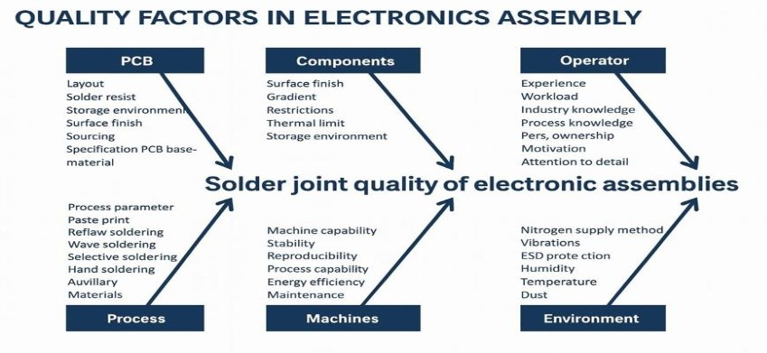

**1.a) Assembly Solutions Wave Soldering Troubleshooting Guide: ![ref4]**

With this easy-to-use Troubleshooting Guide, you can learn to troubleshoot common wave soldering issues. After using it a few times, it will become an essential companion for you and anyone in your company responsible for operating a wave soldering line. 

This Guide offers troubleshooting advice for common wave solder- ing assembly issues by process defect. If your issue is not resolved after following the steps to help identify the possible root cause and solution, please contact your Alpha representative who will be able to provide you with further assistance. 

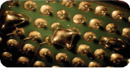 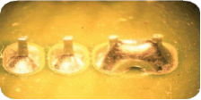

**2.  Bridging:** 

**Definition:** The unwanted formation of a conductive path of solder between conductors 

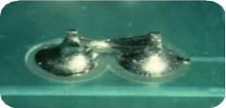 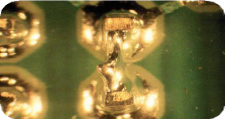 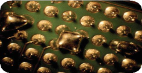

|**Review** |**Name** ||||
| - | - | :- | :- | :- |
|Prepared By |Atul Kumar ||||
|Reviewed By |Sudhakar Babu ||||
|Approved By |Aditi Sharma ||||
|![ref1]|WAVE SOLDERING TROUBLESHOOTING GUIDE |MSM SOP Ref# |UML/EMS/0801 ||
|||Document Number |
UML-SMT-023 

00![ref2]
||
|||Rev # |||
|||Issue Date  |02\.01.2026 ||

Page | 3**Primary process set-up areas to check ![ref3]**

- Conveyor speed too slow 
- Time over preheat is too long causing the flux to be burned off 
- Dwell time too long causing the flux to burn off before exiting the wave 
- Topside board temp too low 
- Not enough flux applied or the flux activity is too low 

**Other things to look for in the Process:** 

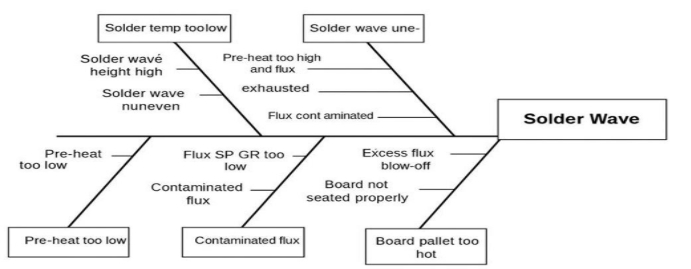

`  `**Other things to look for with the Assembly: ![ref4]**

- Board contamination 
- Component contamination 
- Component lead length too long 
- Improper board handling 

**Other things to look for with the PC FAB:** 

- Board oxidized material 
- Defective mask  
- Board contaminated 

**Other things to look for with the Board Design:** 

- Poor pallet design 
- Lead-to-hole ratio too large 
- Internal ground plane 
- Weight distribution 
- Component orientation 

**Insufficient Solder Topside Fillet:** 

Definition: Where the joint has not formed a good topside fillet 

IPC acceptable: A total maximum of 25% depression, including both the primary solder destination and the secondary solder source sides, is permitted. 

|**Review** |**Name** ||||
| - | - | :- | :- | :- |
|Prepared By |Atul Kumar ||||
|Reviewed By |Sudhakar Babu ||||
|Approved By |Aditi Sharma ||||
|![ref1]|WAVE SOLDERING TROUBLESHOOTING GUIDE |MSM SOP Ref# |UML/EMS/0801 ||
|||Document Number |
UML-SMT-023 

00![ref2]
||
|||Rev # |||
|||Issue Date  |02\.01.2026 ||

Page | 4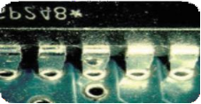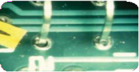![ref3]

**Primary process set-up areas to check** 

- Conveyor Speed too slow 
  - Time over preheat too long, causing the flux to be burned off 
  - Dwell time too long, causing flux to be destroyed before exiting the wave ![ref4]
- Conveyor Speed too fast 
  - Dwell time too short / topside board temp too low 
- Topside board temp too high for flux, causing it to burn off before the wave 
- Not enough flux or the flux is not active enough 
- Solder temp too low, it cools in the barrel before it reaches the top side 
- Wave height too low in one or both waves, so the solder does not contact the board properly 
- Inadequate level of anti-oxidant in lead free alloy 

**Other things to look for in the Process:** 

![ref5]

**Other things to look for with the Assembly** 

- Board oxidized 
- Board contaminated 
- Hole and pad mis-registered 
- Mask in hole 
- Moisture in the laminate 
- Mis-registration of the mask 
- Board warped 
- Poor plating in the hole 
- Component contamination 

|**Review** |**Name** ||||
| - | - | :- | :- | :- |
|Prepared By |Atul Kumar ||||
|Reviewed By |Sudhakar Babu ||||
|Approved By |Aditi Sharma ||||
|![ref1]|WAVE SOLDERING TROUBLESHOOTING GUIDE |MSM SOP Ref# |UML/EMS/0801 ||
|||Document Number |
UML-SMT-023 

00![ref2]
||
|||Rev # |||
|||Issue Date  |02\.01.2026 ||

**Things to look for with the Board Design: ![ref3]**

Page | 5** 

- Poor pallet design  •  Internal ground plane  •  Pad size mismatched 
- Large ground plane on  •  Lead-to-hole ratio too  •  Large  ground  plane  on component site  large or too small  solder side 

**Insufficient Solder Bottom Side Fillet:** 

Definition: Where the joint has not formed a good bottom side fillet 

IPC acceptable: 100% solder fillet and circumferential wetting present on secondary (solder source) side of the solder joint. Minimal acceptable is to have 330° circumferential fillet and wetting prese![ref4]nt for class 3 boards, 270° for class 1 and 2 boards. 

**Primary process set-up areas to check** 

- Conveyor Speed too slow 
- Time over pre-heat too long causing the flux to be burned off 
- Dwell time too long causing flux to be destroyed before exiting the wave 
- Bottom side board temp too high causing flux to be burned off before the wave 
- Not enough flux or flux activity 
- Wave height too low on one or both waves 

**Other things to look for in the Process:** 

![ref6]

**Other things to look for with the Assembly:** 

- Board contamination 
- Component leads too short 
- Improper board handling 
- Component contamination 

**Other things to look for with the PC FAB** 

- Board oxidized 
- Board contaminated 

|**Review** |**Name** ||||
| - | - | :- | :- | :- |
|Prepared By |Atul Kumar ||||
|Reviewed By |Sudhakar Babu ||||
|Approved By |Aditi Sharma ||||
|![ref1]|WAVE SOLDERING TROUBLESHOOTING GUIDE |MSM SOP Ref# |UML/EMS/0801 ||
|||Document Number |
UML-SMT-023 

00![ref2]
||
|||Rev # |||
|||Issue Date  |02\.01.2026 ||

- Mis-registration of the mask ![ref3]

Page | 6 •  Mask in hole 

- Poor plating in the hole 
- Hole and pad mis-registered 
- Board warped 
- Component contamination 

**Other things to look for with the Board Design** 

- Poor pallet design ![ref4]
- Large ground plane on component side 
- Large ground plane on solder side 
- Internal ground plane 
- Lead-to-hole ratio too large 
- Pad size mismatched 
- Weight distribution 

**2. De-wetting or Non-wetting** 

**Definitions:** 

De-wetting is a condition that results when molten solder coats a surface and then recedes to leave an irregularly shaped mound(s) of solder that is separated by areas that are re-covered with a thin film of solder and with the basis metal not exposed. Non-wetting is a condition where there is partial adherence of molten solder to a surface that it has contacted, and the basis metal remains exposed. 

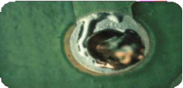 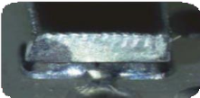 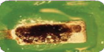

**Primary process set-up areas to check** 

- Usually board-related due to contamination on the surface of the pad 

**Other things to look for in the Process** 

![ref7]

|**Review** |**Name** |
| - | - |
|Prepared By |Atul Kumar |
|Reviewed By |Sudhakar Babu |
|Approved By |Aditi Sharma |

` `Doc No:UML-SMT-023| Rev:  00| Reviosn Date:01/02/2026| This is On Line approved document, No Signature Required | Controlled Document 
|![ref1]|WAVE SOLDERING TROUBLESHOOTING GUIDE |MSM SOP Ref# |UML/EMS/0801 |
| - | :- | - | - |
|||Document Number |
UML-SMT-023 

00![ref2]
|
|||Rev # ||
|||Issue Date  |02\.01.2026 |

Page | 7**Other things to look for with the Assembly ![ref3]**

- Board contamination 
- Insufficient tin plating in immersion tin surface 
- Improper board handling 
- Component contamination 

**Things to look for with the Board Design** 

- Board oxidized ![ref4]
- Board contaminated 

**Solder Voids or Outgassing (Blow Holes and Pin Holes):** 

Definition: Where the solder joint has a small, visible hole that penetrates from the surface of a solder connection between the conductive patterns on internal layers, external layers or both of a board. This is typically due to moisture entrapment that, during the soldering process, outgassed from the joint. 

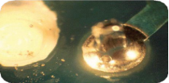 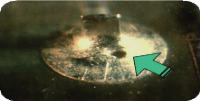

**Primary process set-up areas to check** 

- Topside or overall board temperature too low entrapping moisture that is outgassed at the wave 
- Entrapped fluid by component in through hole 
- Chemical contaminants not removed during PC fab process 
- Contamination in the hole 
- Topside of the hole covered by component body or flashing 

**Other things to look for in the Process** 

![ref8]

|**Review** |**Name** ||||
| - | - | :- | :- | :- |
|Prepared By |Atul Kumar ||||
|Reviewed By |Sudhakar Babu ||||
|Approved By |Aditi Sharma ||||
|![ref1]|WAVE SOLDERING TROUBLESHOOTING GUIDE |MSM SOP Ref# |UML/EMS/0801 ||
|||Document Number |
UML-SMT-023 

00![ref2]
||
|||Rev # |||
|||Issue Date  |02\.01.2026 ||

**Other things to look for with the Assembly: ![ref3]**Page | 8 •  Board contamination 

- Component contamination 
- Improper board handling 

**Things to look for with the PC FAB:** 

- Board oxidized 
- Board contaminated 
- Mask in hole ![ref4]
- Defective mask material 
- Moisture in the laminate 
- Hole and pad mis-registered 
- Board warped 
- Poor plating in the hole 
- Mis-registration of the mask 

**Things to look for with the Board Design** 

- Lead-to-hole ratio too large 
- Lead-to-hole ratio too small 
- Internal ground plane 
- Component orientation 

**Solder Skips** 

**Definition:** Where the component in the board has not been soldered during the soldering process 

**Primary process set-up areas to check** 

- Conveyor speed too fast, so the dwell was too short in the wave 
- Make sure the chip or turbulent wave is turned on 
- Not enough flux 
- Wave height too low on one or both waves 

**Other things to look for in the Process** 

- Solder wave uneven 
- Flux SP GR too high 
- Flux not making contact 
- Check for bent conveyor 
- Pre-heat too high 
- Flux applied unevenly 
- Contaminated flux 
- Conveyor speed high 
- Board not seated properly 
- Insufficient flux blow-off 
- Board pallet too hot 

**Other things to look for with the Assembly** 

- Board contamination 

|**Review** |**Name** ||||
| - | - | :- | :- | :- |
|Prepared By |Atul Kumar ||||
|Reviewed By |Sudhakar Babu ||||
|Approved By |Aditi Sharma ||||
|![ref1]|WAVE SOLDERING TROUBLESHOOTING GUIDE |MSM SOP Ref# |UML/EMS/0801 ||
|||Document Number |
UML-SMT-023 

00![ref2]
||
|||Rev # |||
|||Issue Date  |02\.01.2026 ||

- Component contamination ![ref3]

Page | 9 •  Improper board handling 

**Things to look for with the PC FAB** 

- Board oxidized 
- Board contaminatedInternal ground plane 
- Mis-registration of the mask Component shadowing 
- Poor pallet design 
- Pad size mismatched ![ref4]
- Defective mask material 
- Mask in hole 
- Hole and pad mis-registered 
- Internal ground plane 
- Component shadowing 
- Board warped 
- Component contamination 
- Component orientation 
- Weight distribution 

**Things to look for with the Board Design** 

**Icicles and Flags (Horns)** 

**Definition: An undesirable protrusion of solder from a solidified solder joint or coating** 

**Primary process set-up areas to check** 

- Conveyor speed too slow 
- Time over pre-heat too long, causing the flux to burn off 
- Dwell time too long, causing the flux to be destroyed before exiting the wave 
- Solder temp too low 
- Not enough flux 
- The use of nitrogen will help prevent icicles 

**Other things to look for in the Process:** 

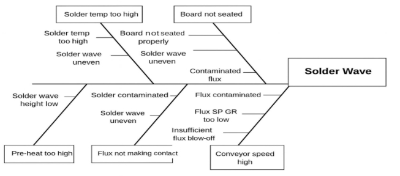

|**Review** |**Name** ||||
| - | - | :- | :- | :- |
|Prepared By |Atul Kumar ||||
|Reviewed By |Sudhakar Babu ||||
|Approved By |Aditi Sharma ||||
|![ref1]|WAVE SOLDERING TROUBLESHOOTING GUIDE |MSM SOP Ref# |UML/EMS/0801 ||
|||Document Number |
UML-SMT-023 

00![ref2]
||
|||Rev # |||
|||Issue Date  |02\.01.2026 ||

**Other things to look for with the Assembly ![ref3]**Page | 10 •  Board oxidized 

- Board contaminated 

**Things to look for with the board design** 

- Poor pallet design 
- Internal ground plane 
- Large ground plane on solder side 

**Solder Balls and Spatter** 

**Definition:** A small sphere of solder adhering to a laminate, resist, or conductor surface – generally occurring after wave or reflow soldering. ![ref4]

**Types:** Random 

Non-random Splash-back 

Spattering type found behind the protruding leads solder balls from fully inserted and tunnel machines 

 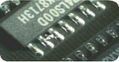 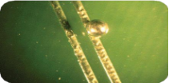

**Random** 

- Easiest to address due to their being process related 
- If you hear a “sizzle” while the board is going over the wave, the preheat is too low or the vehicle is not fully evaporated 
- Solder wave uneven: clean the solder nozzle assembly and check for parallelism 
- Flux contamination: if contaminated it needs to be replaced 
- Check pallet design: look for them to have vents to allow for outgassing 

**Non-random** 

- Found on the bottom side of the board, over many boards, usually to the trailing side of the protruding lead. 
- Not enough flux applied or burned off too soon in the wave 
- Conveyor speed too high 

**Splash-back** 

- Wave height set too high or hot, air knife is set incorrectly 
- Excess turbulence in the wave 
- Increased surface tension due to nitrogen 

**Solder Balls and Spatter (continued)** 

Primary process set-up areas to check 

- Conveyor Speed too slow 
  - Too much time over the pre-heater, causing the flux to burn off too fast 
  - Dwell time too long, causing the flux to be destroyed before exiting 
- Topside board temp too low 
- Conveyor speed too fast 
- Time over the preheat is not long enough to dry off the flux carrier 
  - Not enough flux or the flux is not active enough 

|**Review** |**Name** ||||
| - | - | :- | :- | :- |
|Prepared By |Atul Kumar ||||
|Reviewed By |Sudhakar Babu ||||
|Approved By |Aditi Sharma ||||
|![ref1]|WAVE SOLDERING TROUBLESHOOTING GUIDE |MSM SOP Ref# |UML/EMS/0801 ||
|||Document Number |
UML-SMT-023 

00![ref2]
||
|||Rev # |||
|||Issue Date  |02\.01.2026 ||

- The use of nitrogen may INCREASE the occurrence of solder-balls ![ref3]

Page | 11 •  Flux carrier not being completely dried off by the pre-heater 

- Water-based fluxes should use forced air convection pre-heat 
- Too much flux has been applied 

**Other things to look for in the Process** 

- Solder temp too high 
- Solder wave height high 
- Solder wave uneven 
- Pre-heat too low ![ref4]
- Contaminated flux 
- Flux SP GR too low 
- Insufficient flux blow-off 
- Conveyor speed high 
- Defective fixture 

**Other things to look for with the Assembly** 

- Board contamination 

**Things to look for with the PC FAB** 

- Board contaminated 
- Defective mask material 
- Moisture in laminate 
- Poor plating in the hole 
- Laminate not fully cured 
- Gloss mask has a higher tendency vs. matt finish 

**Things to look for with the Board Design** 

- Poor pallet design 

**Solder on Mask** 

**Definition:** Solder on the mask can occur on solder resist, board surfaces, pallet surfaces and conveyor fingers. 

**Primary process set-up areas to check** 

- Poor flux application 
- Flux and resist incompatibility 
- Poor cure of the solder mask 
- Preheat temperature too high 
- Solder temperature too high. 

|**Review** |**Name** ||||
| - | - | :- | :- | :- |
|Prepared By |Atul Kumar ||||
|Reviewed By |Sudhakar Babu ||||
|Approved By |Aditi Sharma ||||
|![ref1]|WAVE SOLDERING TROUBLESHOOTING GUIDE |MSM SOP Ref# |UML/EMS/0801 ||
|||Document Number |
UML-SMT-023 

00![ref2]
||
|||Rev # |||
|||Issue Date  |02\.01.2026 ||

**Rough or Disturbed Solder ![ref3]**

Page |**  12

**Definition:** A solder fillet that solidified while one or both metals to be joined were vibrating. The result is a weak, non-uniform metallic structure, with many micro-cracks. 

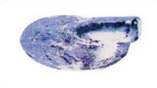

**Primary process set-up areas to check **

- Check conveyor for vibration or “jerky motion” 
- Removal of the board prior to the solder solidifying 

**Other things to look for in the Process** 

- Solder temp too low 
- Solder contaminated 
- Flux applied unevenly 
- Conveyor speed high 
- Solder wave uneven 
- Board not seated right 
- Solder wave height low 
- Early removal of board 
- Excessive solder dross 

Things to look for with the **Board Design** 

- Poor pallet design 

**Grainy or Dull Solder** 

**Definition:** A rough solder surface with small, gritty projections protruding through the top, or a non-shiny surface that shows no signs of chemical attack. 

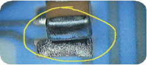 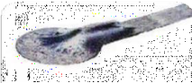

**Primary process set-up areas to check** 

- Impurities in the solder 
- Inter-metallic compounds 
- Dross mixed into the solder 
- Insufficient heat 

**Other things to look for in the Process** 

- Solder temp too low 
- Conveyor vibration 
- Pre-heat too low 
- Conveyor speed high 
- Early removal of board 

|**Review** |**Name** ||||
| - | - | :- | :- | :- |
|Prepared By |Atul Kumar ||||
|Reviewed By |Sudhakar Babu ||||
|Approved By |Aditi Sharma ||||
|![ref1]|WAVE SOLDERING TROUBLESHOOTING GUIDE |MSM SOP Ref# |UML/EMS/0801 ||
|||Document Number |
UML-SMT-023 

00![ref2]
||
|||Rev # |||
|||Issue Date  |02\.01.2026 ||

- Excessive solder dross ![ref3]

Page | 13** 

**Other things to look for with the Assembly** 

- Board contamination 
- Component leads too short 
- Improper board handling 

**Things to look for with the PC FAB** 

- Board contamination 

**Things to look for with the Board Design ![ref4]**

- Board contamination 

Components Lifted 

**Definition:** The lifting of components during wave soldering. 

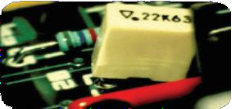

**Primary process set-up areas to check** 

- Conveyor speed too fast 
- Slowing down the conveyor will increase the immersion time in the wave and overcome thermal mismatch or demand 
- Incorrect lead length: short leads may shift and can pop out of the hole 
- Check for board flex or that the board may be warped 

**Other things to look for in the Process** 

- Solder wave height high 
- Solder wave uneven 
- Excess flux blow-off 
- Conveyor vibration 
- Conveyor angle high 
- Early removal of board 
- Board not seated right 
- Defective fixture 

**Other things to look for with the Assembly** 

- Improper board handling 
- Component lead length too long 

**Things to look for with the Board Design** 

- Poor pallet design 

**Flooding** 

**Definition**: Solder “flow over,” thus causing the solder to flood onto the component.** 

|**Review** |**Name** ||||
| - | - | :- | :- | :- |
|Prepared By |Atul Kumar ||||
|Reviewed By |Sudhakar Babu ||||
|Approved By |Aditi Sharma ||||
|![ref1]|WAVE SOLDERING TROUBLESHOOTING GUIDE |MSM SOP Ref# |UML/EMS/0801 ||
|||Document Number |
UML-SMT-023 

00![ref2]
||
|||Rev # |||
|||Issue Date  |02\.01.2026 ||

Page | 14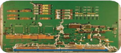![ref3]

**Primary process set-up areas to check** 

- Board may be warped: need centre support in the wave 
- Wave height too high 
- Conveyor too tight or too loose ![ref4]

**Other things to look for in the Process** 

- Pre-heat too high 
- Board rerun 
- Defective fixture 
- Board not seated properly 
- Solder wave height high 
- Solder wave uneven 
- Pre-heat too low 
- Conveyor speed high 
- Conveyor speed low 

**Things to look for with the PC FAB** 

- Board warped 

**Things to look for with the Board Design** 

- Poor pallet design 
- Board size 
- Weight distribution 

**Excessive Solder** 

**Definition:** Occurs when a printed circuit board passing through a soldering process takes with it excessive solder.** 

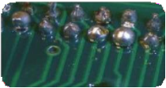 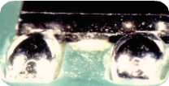

**Primary process set-up areas to check** 

- Conveyor speed too fast 
- Dwell time too short 
- Not enough flux or flux is not active enough 
- Solder temperature too low 

**Other things to look for in the Process** 

- Flux foam head too low 
- Flux not making contact 
- Flux applied unevenly 

|**Review** |**Name** ||||
| - | - | :- | :- | :- |
|Prepared By |Atul Kumar ||||
|Reviewed By |Sudhakar Babu ||||
|Approved By |Aditi Sharma ||||
|![ref1]|WAVE SOLDERING TROUBLESHOOTING GUIDE |MSM SOP Ref# |UML/EMS/0801 ||
|||Document Number |
UML-SMT-023 

00![ref2]
||
|||Rev # |||
|||Issue Date  |02\.01.2026 ||

- Excess flux blow-off ![ref3]

Page | 15 •  Board pallet too hot 

- Defective fixture 
- Solder wave height high 
- Solder contaminated 

**Other things to look for with the Assembly** 

- Component lead length too long  
- Flux Applied unevenly 
- Defective Fixture ![ref4]

**Things to look for with the PC FAB** 

- Defective mask material 
- Component board solderability 
- Poor pallet design 
- Lead length to pad ratio incorrect 
- Component layout or orientation 

|**Review** |**Name** |
| - | - |
|Prepared By |Atul Kumar |
|Reviewed By |Sudhakar Babu |
|Approved By |Aditi Sharma |

` `Doc No:UML-SMT-023| Rev:  00| Reviosn Date:01/02/2026| This is On Line approved document, No Signature Required | Controlled Document 

[ref1]: Aspose.Words.269c0aae-88bc-43c5-9a58-dce964a6e4e9.001.png
[ref2]: Aspose.Words.269c0aae-88bc-43c5-9a58-dce964a6e4e9.002.png
[ref3]: Aspose.Words.269c0aae-88bc-43c5-9a58-dce964a6e4e9.003.png
[ref4]: Aspose.Words.269c0aae-88bc-43c5-9a58-dce964a6e4e9.005.png
[ref5]: Aspose.Words.269c0aae-88bc-43c5-9a58-dce964a6e4e9.015.jpeg
[ref6]: Aspose.Words.269c0aae-88bc-43c5-9a58-dce964a6e4e9.016.jpeg
[ref7]: Aspose.Words.269c0aae-88bc-43c5-9a58-dce964a6e4e9.020.jpeg
[ref8]: Aspose.Words.269c0aae-88bc-43c5-9a58-dce964a6e4e9.023.jpeg
